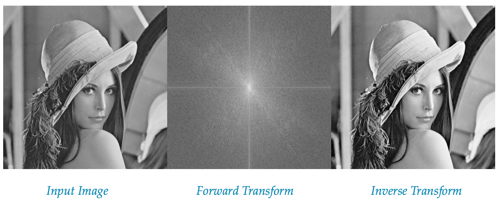
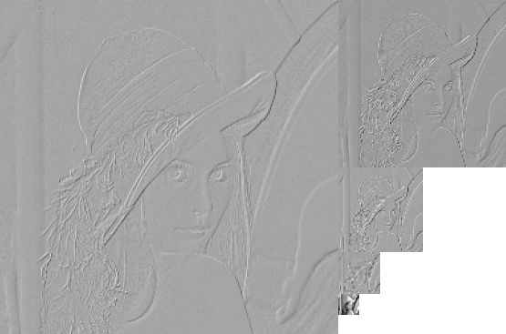

# Image-Processing
Implementations of Fourier Transform, Laplacian Pyramids, Edge Detection

This repository describes Image Processing techniques such as Fourier Transform, Laplacian Pyramids, Edge Detection using Difference of Gaussian, Laplacian of Gaussian. These were implemented as part of assignments for the course _**CSE573: Computer Vision and Image Processing**_ at _University at Buffalo, The State University of New York_ during Fall 2016.

Execution requires the following packages
* Numpy
* Matplotlib
* Scipy

### Fourier Transform

[Fourier Transform](https://en.wikipedia.org/wiki/Fourier_transform) is an important image processing tool to decompose an image to its sine-cosine compositions. The output of this technique represents the image in the frequency domain transformed from the spatial domain. A detailed expaination about Fourier Transformations of Images can be found [here](https://homepages.inf.ed.ac.uk/rbf/HIPR2/fourier.htm)

Fourier Transform can be executed with the command <code>python FourierTransform.py</code>

    
Mean Squared Error between Input Image and the inverse transform is **1.1592e-18**

### Laplacian Pyramids

[Laplacian Pyramids](https://en.wikipedia.org/wiki/Pyramid_(image_processing)#Laplacian_pyramid) is a pyramid representation of images obtained by repeated smoothing and subsampling saving the difference image between the original and smoothed image at each subsampled level. This technique can be used in image compression.

Laplacian Pyramids can be executed with the command <code>python LaplacianPyramids.py</code>

**Input Image**

**Laplacian Pyramid**

**Reconstructed Image**

A mean squared error of 0 was obtained between the input image and reconstructed image indicating perfect reconstruction

### Edge Detection

[Edge Detection](https://en.wikipedia.org/wiki/Edge_detection) is a image processing technique to find boundaries of objects in an image. It is performed by detecting areas in the image with rapid changing intensity. It is used in image segmentation and data extraction.

Edge Detectors can be executed with the command <code>python main.py</code>

**Input Image**

#### Difference of Gaussian

[Difference of Gaussian](https://en.wikipedia.org/wiki/Difference_of_Gaussians) works by performing Gaussian blurs  of different radius on an image and then computing the difference between the outputs of the blurring. Edges are detected by detection of zero crossings in the image and thresholding to keep only the strong edges.

**Difference of Gaussian Edge Detector**

#### Laplacian of Gaussian

[Laplacian of Gaussian](https://en.wikipedia.org/wiki/Blob_detection#The_Laplacian_of_Gaussian) is a second-derivative image processing technique of identifying areas of rapid change(edge) in images. An image is filtered using a Gaussian filter to blur the image and avoid noise. This is done because the Laplacian filter is very sensitive to rapid change including noise. Zero crossing is detected to identify edges in the image.

**Laplacian of Gaussian Edge Detector**

